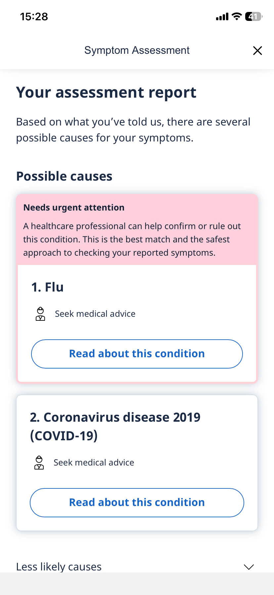

# Template — Evidence Pack

Nộp kèm thin SPEC cuối Day 05.

## 1. Nhóm và track

**Tên nhóm:** e2-3

**Track:** Healthcare

**Product/app đã chọn:** Ada Health

**Build slice đang nghĩ:**

Conversational Symptom Assessment Assistant

Người dùng mô tả triệu chứng bằng ngôn ngữ tự nhiên thay vì chọn từ danh sách có sẵn.

AI sẽ:

* Trích xuất triệu chứng từ hội thoại.
* Suy luận các thông tin còn thiếu.
* Chủ động đặt câu hỏi tiếp theo.
* Xây dựng hồ sơ triệu chứng có cấu trúc.
* Đề xuất các bệnh lý có khả năng liên quan cùng mức độ tin cậy.

Khác biệt chính so với Ada Health:

* Ada: Questionnaire-first (người dùng trả lời chuỗi câu hỏi có cấu trúc).
* Prototype: Conversation-first (người dùng mô tả tự nhiên, AI dẫn dắt hội thoại để thu thập thông tin).

## 2. Self-use evidence

| Observation                           | Screenshot/link                                                                           | Path liên quan             | Điều học được                                                                                        |
| ------------------------------------- | ----------------------------------------------------------------------------------------- | --------------------------- | ---------------------------------------------------------------------------------------------------------- |
| Nhập triệu chứng sốt + đau họng |  | Low-confidence / Correction | App hỏi thêm nhiều câu, một số câu không liên quan nhưng tổng thể dự đoán khá chính xác. |
| Kết quả gợi ý Flu và COVID-19    |  | Low-confidence / Failure    | Dự đoán gần đúng nhưng có thể tạo ra lo lắng với nhiều khả năng bệnh, cần rõ ràng hơn. |

## 3. User / review / social evidence


### 3.1. Scope

**Track:** Healthcare / symptom checker / digital triage  
**Apps & analog sources checked:** Ada Health, WebMD Symptom Checker, K Health, MyVinmec/Vinmec, Reddit discussions.  
**Date gathered:** 2026-06-03  

Ghi chú: Bảng dưới dùng **trích ngắn hoặc diễn giải sát nghĩa từ review public**, không copy dài nguyên văn. Khi đưa vào Evidence Pack, có thể copy các dòng này vào mục **3. User / review / social evidence**.

---

### 3.2. Positive Reviews - 15 items

| # | Quote / review signal | Source | User type | Pain point / need |
|---|---|---|---|---|
| P01 | Review kể app gợi ý đúng hướng sau khi nhiều người chưa chẩn đoán được cơn đau. | [Ada App Store](https://apps.apple.com/us/app/ada-your-health-portal/id1099986434?see-all=reviews&platform=iphone) | Người có triệu chứng đau nặng, chưa rõ nguyên nhân | Cần decision support trước khi trao đổi lại với bác sĩ. |
| P02 | Người dùng lo âu sức khỏe nói Ada giúp biết nên lo bao nhiêu và bớt tự suy diễn. | [Ada App Store](https://apps.apple.com/us/app/ada-your-health-portal/id1099986434?see-all=reviews&platform=iphone) | Người hay lo về triệu chứng nhỏ | Cần reassurance có giới hạn, không chỉ danh sách bệnh đáng sợ. |
| P03 | Review nói câu hỏi của Ada đơn giản, thẳng vào triệu chứng, làm xong trong vài phút. | [Ada App Store](https://apps.apple.com/us/app/ada-your-health-portal/id1099986434?see-all=reviews&platform=iphone) | User cần check nhanh khi đang khó chịu | Cần luồng hỏi ngắn, dễ hiểu, ít ma sát. |
| P04 | Public statement: user ban đầu nghi ngờ nhưng assessment đủ hữu ích để đem tới specialist. | [Ada app page](https://ada.com/app/) | Người có bệnh cần theo dõi chuyên khoa | Cần output có thể dùng làm đầu vào cho cuộc hẹn thật. |
| P05 | Public statement nói Ada thân thiện, dễ dùng và khớp với chẩn đoán chuyên môn sau đó. | [Ada app page](https://ada.com/app/) | Người dùng phổ thông sau khi đi khám | Cần trust qua trải nghiệm dễ dùng và kết quả có kiểm chứng. |
| P06 | Review về bipolar/anxiety: app giúp phân biệt lo âu với đau cơ/tác dụng phụ thuốc. | [Ada JustUseApp](https://justuseapp.com/en/app/1099986434/ada-check-your-health/reviews) | Người có bệnh nền và đang dùng thuốc | Cần app biết hỏi về bệnh nền/thuốc để tránh kết luận nông. |
| P07 | Review nói Ada thay thế việc tự Google triệu chứng gây sợ, giúp định hướng cơ thể đang gặp gì. | [Ada JustUseApp](https://justuseapp.com/en/app/1099986434/ada-check-your-health/reviews) | Người có health anxiety | Cần giảm hoảng loạn do search triệu chứng trên web. |
| P08 | Review về đau lưng/nghi sỏi thận: user đánh giá cao câu hỏi chi tiết. | [Ada JustUseApp](https://justuseapp.com/en/app/1099986434/ada-check-your-health/reviews) | Người chăm sóc người thân | Cần câu hỏi follow-up đủ sâu để phân biệt tình huống giống nhau. |
| P09 | Review panic attack: app giúp user nhận ra không phải tình huống chết người. | [Ada JustUseApp](https://justuseapp.com/en/app/1099986434/ada-check-your-health/reviews) | Người bị panic/lo âu sức khỏe | Cần phân loại mức độ nguy cấp và trấn an đúng cách. |
| P10 | Review appendicitis: app gợi ý đi kiểm tra khi triệu chứng có thể nguy hiểm. | [Ada JustUseApp](https://justuseapp.com/en/app/1099986434/ada-check-your-health/reviews) | Người có đau bụng tăng dần | Cần red-flag handling và khuyến nghị đi khám khi cần. |
| P11 | Review WebMD nói danh sách khả năng giúp user trao đổi với bác sĩ và xét nghiệm đúng hướng. | [WebMD App Store](https://apps.apple.com/us/app/webmd-symptom-checker/id295076329?see-all=reviews&platform=iphone) | Người có nhiều triệu chứng kéo dài | Cần output làm rõ khả năng và xác suất để chuẩn bị câu hỏi cho bác sĩ. |
| P12 | Review WebMD nói tra cứu thuốc giúp phát hiện rủi ro tương tác/khác biệt công dụng. | [WebMD App Store](https://apps.apple.com/us/app/webmd-symptom-checker/id295076329?see-all=reviews&platform=iphone) | Người dùng nhiều thuốc | Cần hỗ trợ an toàn thuốc, không chỉ symptom checker. |
| P13 | Review K Health: user bị sốt, được tư vấn từ nhà và có thuốc điều trị triệu chứng. | [K Health Trustpilot](https://www.trustpilot.com/review/khealth.ai) | Người bệnh cần care từ xa | Cần đường ra hành động rõ: tư vấn, thuốc, follow-up. |
| P14 | Review K Health: user cần renew đơn thuốc ngắn hạn, được hỏi kỹ và nhận thuốc không chậm trễ. | [K Health Trustpilot](https://www.trustpilot.com/review/khealth.ai) | Người cần gia hạn thuốc | Cần luồng hẹp, nhanh, ít cần đi khám trực tiếp. |
| P15 | Review MyVinmec: app được khen giao diện đẹp, dễ dùng và tiện book lịch khám. | [MyVinmec App Store](https://apps.apple.com/vn/app/myvinmec/id1494832536?platform=iphone&see-all=reviews) | Bệnh nhân/khách hàng bệnh viện | Cần quản lý lịch khám và thao tác dịch vụ y tế thuận tiện. |

---

### 3.3. Negative Reviews - 15 items

| # | Quote / review signal | Source | User type | Pain point / failure mode |
|---|---|---|---|---|
| N01 | Review Google Play nói bản update Ada gần đây kém kỹ hơn và tạo cảm giác AI thiếu chính xác. | [Ada Google Play](https://play.google.com/store/apps/details?hl=en_US&id=com.ada.app) | Người từng dùng Ada để giảm medical anxiety | Trust issue: app đổi behavior làm user mất niềm tin. |
| N02 | Review Google Play nói lịch sử cũ và profile phụ huynh bị mất sau update. | [Ada Google Play](https://play.google.com/store/apps/details?hl=en_US&id=com.ada.app) | Người quản lý hồ sơ cho gia đình | Data continuity failure: mất history/profile làm app khó tin. |
| N03 | Review Trustpilot: user chờ gọi lại về COVID meds nhưng không nhận được cuộc gọi. | [Ada Trustpilot](https://www.trustpilot.com/review/www.ada.com) | Người cần tư vấn/thuốc COVID | Failure path: lời hứa callback không xảy ra. |
| N04 | Review Trustpilot: user được báo gọi trong 2 giờ nhưng chờ 7 giờ vẫn không có phản hồi. | [Ada Trustpilot](https://www.trustpilot.com/review/www.ada.com) | Người cần care kịp thời | Trust issue: SLA không rõ hoặc không được thực hiện. |
| N05 | Review WebMD nói update symptom checker làm kết quả đau bụng đi tới khả năng đáng sợ, thiếu hỏi pain details. | [WebMD JustUseApp](https://justuseapp.com/en/app/295076329/webmd-symptom-checker/reviews) | Người check đau bụng cho chồng | Wrong recommendation / anxiety escalation. |
| N06 | Review WebMD beta: tìm symptom/condition/medication khó, thiếu nhiều lựa chọn phổ biến. | [WebMD JustUseApp](https://justuseapp.com/en/app/295076329/webmd-symptom-checker/reviews) | User nhập triệu chứng và bệnh nền | Confusing input: search terms và list values không đủ. |
| N07 | Review WebMD nói sau update app không hỏi antibiotic use và bỏ sót điều kiện đúng từng xuất hiện trước đó. | [WebMD JustUseApp](https://justuseapp.com/en/app/295076329/webmd-symptom-checker/reviews) | Người so sánh kết quả trước/sau update | Wrong recommendation do thiếu câu hỏi follow-up quan trọng. |
| N08 | Review App Store: user nhận cảnh báo bảo mật nhưng không đổi được password vì vòng loading không kết thúc. | [WebMD App Store](https://apps.apple.com/us/app/webmd-symptom-checker/id295076329?see-all=reviews&platform=iphone) | Người có account health-related | Trust/privacy issue: không xử lý được action bảo mật cơ bản. |
| N09 | Review App Store: medication reminder có thể mark nhầm là đã uống và không undo được. | [WebMD App Store](https://apps.apple.com/us/app/webmd-symptom-checker/id295076329?see-all=reviews&platform=iphone) | Người theo dõi thuốc hằng ngày | Correction path thiếu: sai thao tác nhưng không sửa được. |
| N10 | Reddit HealthAnxiety: symptom checker khiến user lặp lại việc thêm/xóa symptom và tăng anxiety. | [Reddit - WebMD symptom checker](https://www.reddit.com/r/HealthAnxiety/comments/feuwkh/webmd_symptom_checker_is_the_worst_thing_that/) | Người có health anxiety | Failure mode: tool kéo user vào vòng xoáy self-diagnosis. |
| N11 | Reddit AskReddit: ví dụ WebMD trả khả năng nghiêm trọng cho triệu chứng phổ biến như headache. | [Reddit - WebMD examples](https://www.reddit.com/r/AskReddit/comments/c5unij/people_who_used_webmd_symptom_checker_what_were/) | Người check symptom phổ biến | Wrong recommendation / over-alarm cho triệu chứng thường gặp. |
| N12 | Review K Health: người dùng bị đưa vào hàng chờ nhiều giờ sau khi đã trả tiền. | [K Health Trustpilot](https://www.trustpilot.com/review/khealth.ai) | Người cần gặp clinician nhanh | Wait-time failure: kỳ vọng care nhanh bị phá vỡ. |
| N13 | Review K Health: user mô tả phải trả lời lặp lại, clinician hỏi lại như symptom checker. | [Reddit - K Health](https://www.reddit.com/r/povertyfinance/comments/ocr49z/is_khealth_legit_and_how_does_it_work/) | Người cần điều trị nhiễm trùng/triệu chứng rõ | Too many repeated questions; handoff AI-human kém. |
| N14 | Review K Health: chat bị đóng, không tìm được cách reopen và support trả lời canned message. | [Reddit - K Health](https://www.reddit.com/r/povertyfinance/comments/ocr49z/is_khealth_legit_and_how_does_it_work/) | First-time telehealth user | Recovery path thiếu: user mất luồng khi phải rời app. |
| N15 | Review MyVinmec Google Play: user không đăng nhập/kết nối profile được do lỗi phone number/loading. | [MyVinmec Google Play](https://play.google.com/store/apps/details?id=com.vinmec.onevinmec) | Khách hàng bệnh viện có hồ sơ sẵn | Account/profile failure: rào cản trước khi nhận hỗ trợ y tế. |

---

### 3.4. Evidence clusters

| Cluster | Evidence IDs | What it means for product |
|---|---|---|
| Trust issue | N01, N02, N03, N04, N08, N15 | User dễ mất niềm tin khi app đổi hành vi, mất history, hoặc không thực hiện promise như callback/security/profile. |
| Too many / repeated questions | P08, N07, N13, N14 | Câu hỏi cần đủ sâu nhưng phải giải thích được vì sao hỏi; handoff sang human không nên bắt user lặp lại. |
| Wrong recommendation / over-alarm | N05, N07, N10, N11 | Symptom checker phải tránh trả output quá đáng sợ khi thiếu context; cần low-confidence path. |
| Confusing input/output | N06, N09, N14 | Search symptom, chọn thuốc/bệnh nền, và sửa sai cần rõ ràng; correction path là bắt buộc. |
| Decision support needs | P01, P02, P04, P06, P09, P10, P11, P12 | User không chỉ cần tên bệnh; họ cần mức độ nguy cấp, lý do, bước tiếp theo, và output có thể đem đi khám. |

---
## 4. Competitor / analog evidence

Dùng cùng input trên mọi app:

- **Case A (rõ ràng):** Sốt + đau họng 2 ngày.
- **Case B (mơ hồ):** Mệt mỏi, hơi chóng mặt.
- **Case C (red flag):** Đau ngực lan ra tay trái + khó thở.

| App / mô hình                                  | Họ xử lý task triage thế nào? (User flow)                                                                                                                                                                                                            | Strength                                                                                                                                                  | Weakness                                                                                                                                                                                                                            | Pattern học được                                                                                                     | Áp dụng trong 1 ngày?                                                       |
| ------------------------------------------------ | --------------------------------------------------------------------------------------------------------------------------------------------------------------------------------------------------------------------------------------------------------- | --------------------------------------------------------------------------------------------------------------------------------------------------------- | ----------------------------------------------------------------------------------------------------------------------------------------------------------------------------------------------------------------------------------- | ------------------------------------------------------------------------------------------------------------------------ | ------------------------------------------------------------------------------ |
| **Ada Health**                             | Nhập triệu chứng dạng free-text → AI hỏi loạt câu hỏi trắc nghiệm thích ứng (Bayesian, hỏi ít nhất có thể) → ra báo cáo: mức độ khẩn + danh sách "possible causes". Có**8 mức triage** từ Self-care → Gọi cấp cứu. | Hỏi thích ứng, ít gây mệt; có thang triage rất chi tiết (8 mức); luôn kèm disclaimer "không phải chẩn đoán"; triage tốt hơn diagnosis. | Top-1 diagnosis ~54–70%, vẫn kém bác sĩ; onboarding hỏi nhiều câu profile gây nản; phụ thuộc user mô tả đúng.                                                                                                       | **Adaptive questioning** + **thang triage rõ ràng nhiều mức** + disclaimer rõ.                          | Có — bắt chước được "hỏi 3 câu → phân 3 mức" ở dạng tối giản. |
| **WebMD Symptom Checker**                  | Chọn triệu chứng trên body-map + chọn vị trí, mức độ → ra danh sách bệnh khả dĩ. Tương tác kiểu form/click, không hội thoại.                                                                                                        | Phổ biến, nhiều người biết; nội dung y khoa phong phú để đọc thêm.                                                                           | Diagnosis chính xác chỉ**3–36%** tùy bệnh; rủi ro **false reassurance** (bỏ sót dấu hiệu nguy cấp) và **overtriage**; phụ thuộc nặng vào việc user chọn đúng vùng/mức độ.                | Né kiểu "ép user tự phân loại y khoa"; cần AI gánh phần suy luận thay vì bắt user chọn.                     | Một phần — học cái**nên tránh** hơn là cái nên copy.          |
| **MyVinmec (VN)**                          | App quản lý sức khỏe của Vinmec: hồ sơ y tế online, đặt lịch, Q&A hỏi bác sĩ, khám từ xa, QR check-in. AI hiện chủ yếu ở**chẩn đoán hình ảnh y khoa**, *không* phải symptom triage hội thoại.                        | Bối cảnh**Việt Nam thật**, có bác sĩ thật phía sau; tích hợp đặt lịch → hành động tiếp theo rõ.                                 | Không có triage triệu chứng tự động kiểu Ada; AI tập trung imaging; muốn hỏi phải qua người.                                                                                                                          | **Human-in-the-loop** + nối thẳng tới hành động (đặt lịch/hỏi bác sĩ).                                 | Học pattern "AI gợi ý → chuyển sang đặt lịch/bác sĩ thật".          |
| **Babylon Health (đã phá sản 2023)**   | Chatbot hội thoại triage: hỏi triệu chứng → khuyến nghị self-care / gặp GP / cấp cứu; nối với video GP.                                                                                                                                      | Ý tưởng hội thoại triage + telehealth liền mạch (mô hình tham vọng).                                                                            | Tuyên bố "ngang bác sĩ" bị bác bỏ; thực chất là**decision tree if/then**; **bỏ sót dấu hiệu đau tim**; chẩn đoán nhầm; rủi ro "gaming" để lấy lịch khám; lộ dữ liệu; cuối cùng phá sản. | Bài học**thất bại**: đừng overclaim, phải xử lý red-flag, đừng giả AI khi chỉ là rule.               | Không build lại — dùng làm cảnh báo về failure/trust.                  |
| **ChatGPT / Gemini (chatbot tổng quát)** | User gõ tự do mô tả triệu chứng → trả lời hội thoại, giải thích, gợi ý nên làm gì. Không có thang triage chuẩn.                                                                                                                      | Linh hoạt, hiểu mô tả tự nhiên; tốt để**chuẩn bị trước/sau khi gặp bác sĩ**.                                                        | Audit BMJ 2026: ~50% câu trả lời health có vấn đề;**undertriage 52% ca cấp cứu**; "nhận ra dấu hiệu nguy hiểm trong giải thích nhưng vẫn trấn an"; nguồn dẫn chỉ ~40% đầy đủ, nhiều citation bịa.  | Học**sức mạnh hội thoại tự nhiên** nhưng phải **bọc** bằng red-flag rule + dẫn nguồn ép buộc. | Có thể dùng LLM làm lõi, nhưng phải thêm guardrail.                    |

## 5. Evidence -> Insight

```text
Evidence nổi bật nhất:

* Khi nhập triệu chứng sốt và đau họng, Ada Health đặt thêm nhiều câu hỏi để thu thập thông tin trước khi đưa ra kết quả.
* Kết quả cuối cùng dự đoán Flu và COVID-19 tương đối hợp lý, tuy nhiên người dùng khó hiểu vì sao hệ thống lại đưa ra các khả năng đó và mức độ khác nhau giữa chúng.

Insight:

User không chỉ gặp khó ở việc biết mình có thể mắc bệnh gì.

Thật ra họ cần một quá trình trao đổi tự nhiên để mô tả tình trạng của mình và hiểu được lý do đằng sau các đánh giá của hệ thống, vì việc phải trả lời nhiều câu hỏi có cấu trúc và nhận về nhiều khả năng bệnh cùng lúc có thể gây bối rối hoặc thiếu tin tưởng vào kết quả.

Opportunity:

AI có thể giúp bằng cách tự động phân tích triệu chứng từ hội thoại tự nhiên, chủ động hỏi bổ sung các thông tin còn thiếu và giải thích rõ các triệu chứng nào dẫn tới từng nhận định bệnh lý thay vì chỉ hiển thị danh sách kết quả cuối cùng.

```

## 6. Evidence đổi SPEC như thế nào?

- [ ] Đổi user chính.
- [X] Đổi pain statement.
- [ ] Đổi build slice.
- [X] Đổi Auto/Aug decision.
- [X] Đổi 4 paths.
- [X] Đổi failure mode.
- [ ] Đổi owner/test plan.

Ghi rõ 1-2 thay đổi quan trọng:

```text
- Trước evidence, nhóm định xây dựng một AI Health Assistant tập trung vào việc phân loại mức độ nghiêm trọng của triệu chứng (Self-care / See Doctor / Emergency) để hỗ trợ người dùng quyết định có nên đi khám hay không.

Sau evidence, nhóm đổi thành một Conversational Symptom Assessment Assistant, tập trung vào việc thu thập triệu chứng bằng ngôn ngữ tự nhiên, tự động suy luận các thông tin còn thiếu, và đề xuất các bệnh lý có khả năng liên quan cùng mức độ tin cậy.

Lý do:

Trong quá trình self-use với Ada Health, nhóm nhận thấy chất lượng đánh giá của hệ thống khá tốt nhưng trải nghiệm tương tác còn cứng nhắc do phải trả lời nhiều câu hỏi dạng lựa chọn. Các review và observation cũng cho thấy người dùng dễ mất kiên nhẫn với questionnaire dài. Nhóm nhận thấy cơ hội nằm ở việc cải thiện quá trình thu thập triệu chứng thông qua hội thoại tự nhiên thay vì chỉ cải thiện kết quả phân loại cuối cùng.

- Trước evidence, nhóm định sử dụng mô hình Augmentation, trong đó AI chỉ đóng vai trò gợi ý mức độ rủi ro và người dùng tự diễn giải kết quả.

Sau evidence, nhóm chuyển sang Conditional Automation cho bước thu thập triệu chứng, trong đó AI chủ động trích xuất triệu chứng từ hội thoại, xác định thông tin còn thiếu và quyết định câu hỏi tiếp theo cần hỏi.

Lý do:

Qua phân tích các symptom checker hiện tại, phần khó khăn nhất không nằm ở việc hiển thị kết quả mà nằm ở việc thu thập đủ dữ liệu đầu vào để đánh giá. Vì vậy AI cần chủ động điều hướng hội thoại và tự động hóa quá trình khai thác triệu chứng, đồng thời vẫn yêu cầu xác nhận lại các triệu chứng quan trọng nhằm giảm rủi ro hiểu sai.

```
